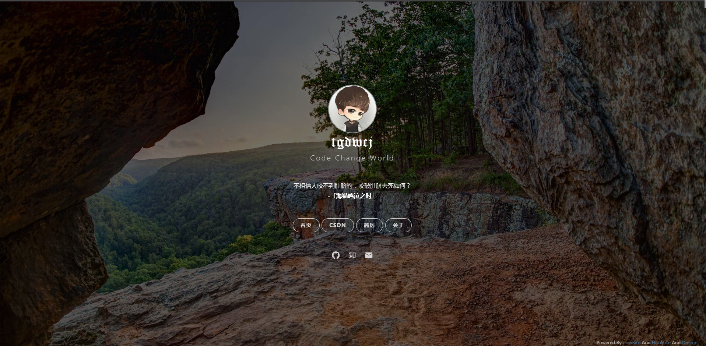

### 个人主页
>这是我的个人主页

>主要基于 [dmego](https://i.dmego.me/) 的个人主页进行修改，有兴趣的可以Fork一下~~

### 效果图

>静态图

### 注

- 访问地址：[个人主页](http://tgdwcj.github.io/)
- 使用了 [一言](http://hitokoto.cn/) 的 API 服务
- ~~使用了 [Bing 壁纸 API](https://github.com/xCss/bing/) 服务~~
- ~~使用了 [Yahoo Query Language (YQL)](https://developer.yahoo.com/yql/) 来解决获取 Bing 壁纸跨域问题~~

### 更新时间

>2019-6-22
